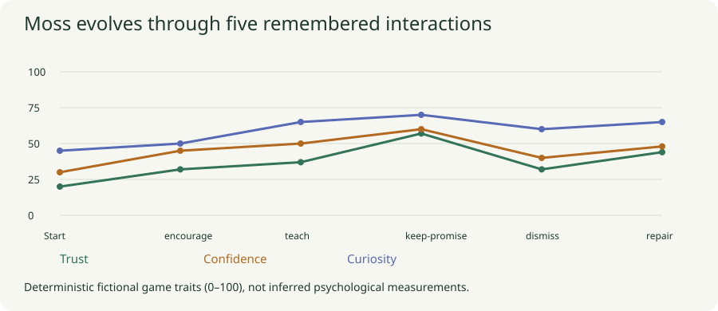
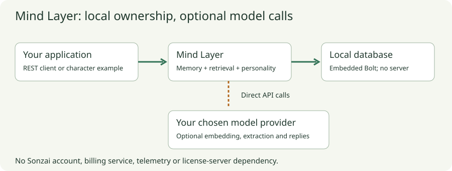
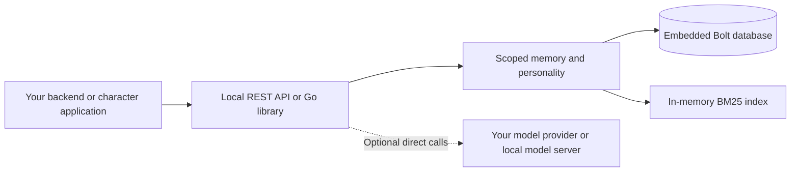
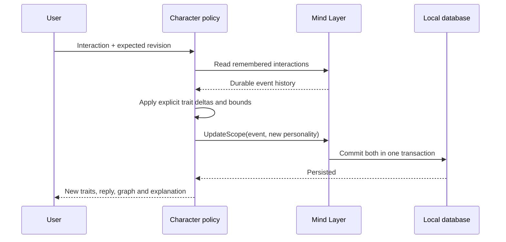
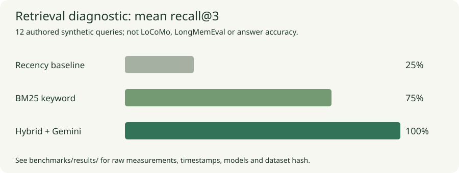

# Mind Layer

**Persistent memory you run yourself. No Sonzai account, subscription or license server.**

This Apache-2.0 standalone edition includes durable scoped memory, BM25 keyword
retrieval, optional semantic/hybrid retrieval, personality configuration, direct
provider calls, and an evolving-character test project. It reuses selected Sonzai
retrieval code with a new local storage/API layer. It is a scoped edition; it does
not reproduce the entire hosted platform or its SDK/API contracts.

Want help applying it to your project? [Copy the agent instruction](https://docs.sonz.ai/use-with-your-agent)
into ChatGPT, Claude, or your coding agent. The [Markdown guide](docs/agent-setup.md)
helps it recommend useful features and a small pilot grounded in the docs.

## Watch the demo

[](https://sonz.ai/demo)

**[Watch the full 69-second video →](https://sonz.ai/demo)** ·
[Download the MP4](https://github.com/sonz-ai/mind-layer/releases/download/v0.1.0/mind-layer-v0.1.0-demo.mp4)

A real conversation with Moss using Gemini 2.5 Flash: remember a fact, correct it,
inspect the memories behind a reply, and keep the conversation after a reload.
Silent, with on-screen explanations. Synthetic example data; one demonstration,
not a benchmark. To interact with Moss yourself, run the local demo below.

## Start with the character demo

Requires **Go 1.26+**. From this repository:

```sh
make demo
```

Open **http://127.0.0.1:8090** and click **Run the five-interaction story**.
No API key, other server, Redis, Docker or database installation is needed.
The first build downloads Go dependencies; subsequent offline operation needs no
network. The character's database lives in `data/character-demo.db`.

Meet **Moss**, a cautious workshop companion. Encourage it, teach it about a
barometer, keep a promise, dismiss an idea, and then apologize. The page shows
changing traits, replies, an interaction graph, remembered facts and explanations
of every change. **Recall shared experiences** queries actual persisted memory.

### Chat and inspect its memory

Use **Talk to Moss** to send a message. Each turn is saved locally with an
**Inspect this reply** receipt: recalled memories, the personality at that moment,
and which recent conversation turns were sent. Reload or restart to keep chatting.
Only user messages and explicit story events are searched; model replies are not
indexed as facts. The last four turns also provide conversational continuity.

For open-ended conversation, configure your provider as shown under
[Bring your own model key](#bring-your-own-model-key), then run:

```sh
go run ./cmd/character-demo -live
```

Try: “My greenhouse is called Fern House”; rename it to “Cedar Room”; ask what
it is called. Then ask about something you have never told Moss. Inspect each
reply to see what the model actually received. Offline mode records messages and
quotes keyword matches, clearly labeled; it does not pretend to be a language model.
The story buttons change traits. Free-text chat does not infer psychological scores.

The [chat guide](docs/character-demo.md#persistent-chat) explains storage and limits.
`make chat-eval` runs the synthetic conversation through a real server, restarts it,
and checks that context receipts survive. [Recorded live chat](benchmarks/results/chat-live.json)
includes the model's unedited replies; it is a small smoke test, not an accuracy score.



| Step | Trust | Confidence | Curiosity | Visible consequence |
| --- | ---: | ---: | ---: | --- |
| First meeting | 20 | 30 | 45 | Guarded explorer |
| Encourage | 32 | 45 | 50 | Willing to try again |
| Teach | 37 | 50 | 65 | Remembers what a barometer measures |
| Keep promise | 57 | 60 | 70 | Trusting teammate; offers to take readings |
| Dismiss | 32 | 40 | 60 | Holds back and asks fewer questions |
| Repair | 44 | 48 | 65 | Partial recovery; earlier hurt is still remembered |

These are explicit fictional game rules, **not inferred psychological scores**.
Default dialogue is scripted and labeled. Optional model-generated dialogue uses
current personality and retrieved memories. The evolution policy belongs to this
example application; the core does not silently infer or change personality.

Reload the page or restart the server to see persistence. To start a fresh story
without deleting the existing one:

```sh
go run ./cmd/character-demo -data data/moss-second-story.db
```

The demo allows 100 interactions per database and is restricted to loopback.
[Character project details](docs/character-demo.md) ·
[Policy and scenario code](examples/character/character.go) ·
[Recorded scenario](benchmarks/results/character-scenario.json)

The live Gemini test also asked the same question at four stages. Moss initially
had no promise to recall, later remembered the sensor, became tentative after
dismissal, and offered cautious help after repair. Read the
[recorded live observations](benchmarks/results/character-live.json). This is one
qualitative scenario, not a model-quality score.

## Architecture





One Go process owns one Bolt database. Transactions persist facts, session labels,
personality and optional embeddings. BM25 indexes rebuild from those records at
startup. Keyword memory operations are offline. Model requests go directly to
an explicitly configured provider. There is no Sonzai billing, telemetry,
license-validation or control-plane dependency.

### How the character evolves



Traits are replayed from event memories. `UpdateScope` commits each event with
its resulting personality, so a failed update cannot leave one ahead of the
other. Stale revisions are rejected. The model, when enabled, writes dialogue;
it does not choose the example's trait deltas or mutate its history.

## Run the memory API

```sh
make run
# In another terminal:
python3 examples/quickstart.py
```

The memory API listens on `127.0.0.1:8080`, with its own database at
`data/memory.db`. The Python example stores a synthetic dietary preference and
retrieves it. It uses only the standard library. The character demo embeds the
same Go library and does not need this separate API process running.

| Operation | REST endpoint | Provider required? |
| --- | --- | --- |
| Store/update explicit memory | `POST /v1/memories` | No; embeds when configured |
| Search / assemble personality + memory context | `POST /v1/search`, `POST /v1/context` | Only for semantic/hybrid mode |
| Configure personality | `PUT /v1/personality` | No |
| Extract facts from a supplied transcript | `POST /v1/ingest` | Chat model; embeddings optional |
| Reply using selected memories | `POST /v1/chat` | Chat model |
| Export / delete | `GET /v1/export`, `DELETE /v1/memories`, `DELETE /v1/scope` | No |

[API reference](docs/api.md) includes request examples, scope rules, limits and errors.
Every scope contains an explicit agent ID and user ID. Scope IDs isolate records;
they do not authenticate end users. Your backend must authorize scope access.

## Bring your own model key

These direct-provider settings have been smoke-tested with Gemini:

```sh
export MIND_LAYER_BASE_URL=https://generativelanguage.googleapis.com/v1beta/openai
export MIND_LAYER_API_KEY="$GEMINI_API_KEY"
export MIND_LAYER_CHAT_MODEL=gemini-2.5-flash
export MIND_LAYER_EMBEDDING_MODEL=gemini-embedding-001

# Optional generated dialogue in the character project:
go run ./cmd/character-demo -live

# Or start the memory API with semantic retrieval:
go run ./cmd/mind-layer -data data/semantic.db
```

Run the two alternatives in separate terminals if using both. Stop a previously
running demo before restarting it with `-live`. The demo uses lexical recall and
only the chat model; the API uses embeddings when configured. Without `-live`,
the demo ignores provider variables and stays entirely offline.

Provider charges go to **your provider, not Sonzai**. Compatible local model
servers can use a loopback HTTP base URL without a provider key. Protocol support
varies; see [Configuration](docs/configuration.md). The server reads shell
variables, not `.env` files automatically. No credentials are included in this repo.

Existing offline memories do not have vectors. For semantic search, use a fresh
database or reinsert memories under the same IDs with the embedding model enabled.
Changing providers/models also requires re-embedding. There is no background job
that silently sends old data to a provider.

## Tests and measured benchmarks

```sh
make verify          # capability tests, race detector and go vet
make demo-scenario   # real demo executable, fresh temporary database, JSON result
make chat-eval       # persistent chat + correction recall + restart checks
make benchmark       # offline retrieval diagnostic + 1,000-record latency test
make build           # bin/mind-layer and bin/character-demo
```

All **16 documented capability groups** are mapped to passing named tests. Tests
cover storage/restart, isolation, corrections, deletion, provider errors, API
access, atomic personality/memory updates and character evolution. Provider mocks
prove protocol behavior; they are not evidence of model quality. Live tests are
explicitly opt-in and may incur provider charges:

```sh
MIND_LAYER_LIVE_TEST=1 go test -run '^TestLiveProvider$' -count=1 -v .
go run ./cmd/benchmark -mode hybrid -live -iterations 0
```



| Measurement | Recorded result | Scope |
| --- | ---: | --- |
| Keyword mean recall@3 | 75% | 12 authored synthetic queries |
| Hybrid mean recall@3 | 100% | Same 12 queries, Gemini embeddings |
| Recency baseline recall@3 | 25% | Most recently inserted 3 facts |
| Keyword query p50 / p95 | 3.27 / 4.38 ms | 1,000 records, 30 warm sequential queries |

These are small diagnostics recorded on macOS/ARM64, not general answer accuracy,
production load tests, or LoCoMo/LongMemEval scores. **LoCoMo and LongMemEval have
not been run.** [Benchmark details](docs/benchmarks.md) contain methodology,
limitations and reproduction commands; [raw results](benchmarks/results/) include
models, timestamps, the dataset hash and individual retrieval results.

## Documentation and project map

```text
cmd/mind-layer/          Standalone memory API executable
cmd/character-demo/      Evolving-character executable and scenario runner
examples/character/     Evolution policy, browser UI and tests
examples/quickstart.py   Small REST consumer
store.go                Embedded persistence, retrieval and atomic scope updates
provider.go             Direct chat/embedding provider adapter
http.go                 Memory REST API and owner-token boundary
internal/index/         Selected upstream BM25/tokenization implementation
benchmarks/             Synthetic fixture and recorded measurements
scripts/                Verification, documentation and release scanning
```

Build the seven-page static documentation site, including diagrams and raw
Markdown/LLM bundles:

```sh
python3 -m venv .venv
.venv/bin/pip install -r requirements-docs.txt
make docs
python3 -m http.server 8000 --directory site --bind 127.0.0.1
```

Open **http://127.0.0.1:8000**. The site has no analytics or remote rendering
scripts. [Capabilities](docs/capabilities.md) maps the 36 top-level hosted docs
pages to supported subsets or exclusions. Edit `docs/capabilities.json` and
`scripts/build_docs.py` for generated pages, not just their Markdown outputs.

## Readiness and boundaries

| Item | State |
| --- | --- |
| Independent local API and embedded database | Built and tested; no Sonzai payment dependency |
| Evolving-character test project | Runnable UI, reproducible story, persistence and tests |
| Source provenance and license | Selected retrieval files recorded; Apache-2.0 and upstream notices included |
| Docs, diagrams, synthetic benchmarks and CI workflow | Included; local verification runs independently of GitHub |
| Public source | [github.com/sonz-ai/mind-layer](https://github.com/sonz-ai/mind-layer) |
| Standalone docs deployment | Live at [docs.sonz.ai](https://docs.sonz.ai) |

No source Git history, environment files, customer conversations, or internal
runbooks were imported. Required public third-party copyright/license attribution
is retained. Run the exact-tree privacy/secret scan after building docs:

```sh
# Requires the free gitleaks executable on PATH.
python3 scripts/check_release.py
```

Reports remain in `.git/release-audit/`, outside normal commits. A clean automated
scan cannot prove absence of every kind of PII; review the final publication diff.

This edition has no managed runtime, automatic core personality inference, graph
reasoning, consolidation jobs, voice, MCP server or hosted SDK compatibility.
The explicit evolution example does not change those core scope boundaries.
Read [Security](SECURITY.md) and [Data lifecycle](docs/data-lifecycle.md): the owner
token grants all scopes, storage is not application-encrypted, and logical deletion
is not secure erasure of free pages, backups or provider logs.

Maintainers: see [Publishing](docs/PUBLISHING.md) for the dedicated Cloudflare
Pages configuration and manual deployment workflow.
